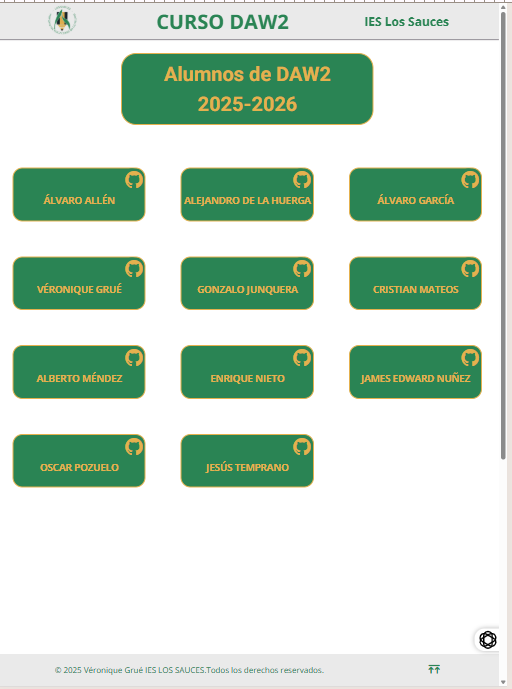

# Proyecto  Indice de 2 CFGS Desarrollo de Aplicaciones Web

Cada alumno/a del ciclo tiene su propio dominio y repositorio personal. En esta página puedes acceder fácilmente a los enlaces de cada uno.

## Captura de Pantalla

## 🛠️ Tecnologías utilizadas

## 🌐 Enlace a la web

Puedes visitar el proyecto en: [daw2.ieslossauces.es](https://daw2.ieslossauces.es/)

## 👥 Autores

Proyecto desarrollado por los alumnos/as del ciclo **Desarrollo de Aplicaciones Web** del [IES Los Sauces](https://daw2.ieslossauces.es/).

- [Véronique Grué] (https://github.com/verogmayo)
